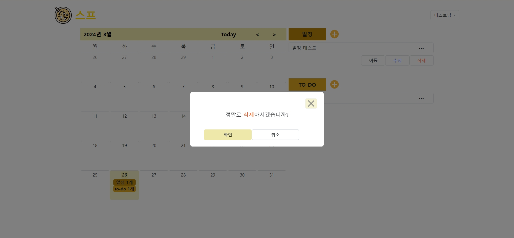

# Laravel Project - SF(Schedule Friends)

## 프로젝트 소개
일정 및 할 일 관리 사이트입니다.

## 개발 환경
+ `PHP 8.0.2`
+ **Framework** : Laravel 9.19
+ **Database** : Maria DB 10.12

## 주요 기능
#### 로그인

+ ID 찾기

+ 임시비밀번호 발급

+ 소셜 로그인

#### 회원가입
+ ID 중복 확인

#### 캘린더
+ 투두 및 일정 추가, 읽기, 수정, 삭제(CRUD)

#### 회원정보
+ 회원정보 변경

+ 투두 달성률 통계

